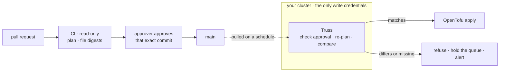

<picture>
  <source media="(prefers-color-scheme: dark)" srcset="docs/assets/truss-lockup-ondark.svg">
  
</picture>

# Truss

**Approved, or not applied.**

Truss is a self-hosted, gated OpenTofu applier. It runs inside your cluster,
holds the only credentials that can change your infrastructure, and applies a
merged commit only after checking for itself that a human approved that exact
commit — and that what it is about to run is what they reviewed. It also
mints and rotates the credentials your infrastructure depends on, and reports
drift nobody asked for. It does not care who wrote the change: a teammate, a
script, or a coding agent.

## The problem

Whatever runs `apply` owns production. In most setups that is CI, or a pull
request bot, holding write credentials while it plans code nobody has approved
yet — and a plan can run code. Branch protection records that somebody
reviewed the change. Nothing checks that what ran is what they read.

That was tolerable while every change came from someone you hired. It stops
being tolerable the day you want a coding agent writing your infrastructure.
Writing the diff was never the hard part. Trusting whatever the author can
reach with the keys to production was.

Truss moves the keys to the one place a pull request cannot reach. Anyone, or
anything, can propose a change. Only an approval gets it applied, and the
component holding the keys checks that approval itself, every time.

## What you get

- **CI needs read access, and nothing more.** It plans, posts the diff, and
  files a digest of the plan it showed. A compromised CI can make Truss
  refuse. It cannot make Truss apply.
- **An approval covers one commit, and Truss checks it itself.** Every pass
  re-reads branch protection from GitHub, then checks each new commit on
  `main`: one merged pull request, approved by your approver at that exact
  head, merge commit signed by GitHub. Turn protection off and you have not
  weakened Truss. You have stopped it.
- **What was reviewed is what runs.** Truss plans each OpenTofu configuration
  again, on its own, and refuses anything that does not match the digest CI
  filed. It takes a fingerprint from CI, never a plan to execute. A missing
  digest is a refusal, not a skip.
- **Credentials do not rot quietly.** Truss re-plans the configuration that
  creates your credentials every day, so one written to mint by date rotates
  with no cron job and no human. What no API can mint, it watches: anything
  close to expiry, or carrying no date at all, is named daily until somebody
  renews it.
- **Drift is named, never fixed.** Once a day every configuration is planned,
  nothing is applied, and whatever differs from git is listed by name.
  Quietly undoing a change somebody made mid-incident would be its own outage.
- **Silence means it stopped.** Every pass reports, success included, and can
  push metrics that tell a refused plan from a broken apply. The ledger lives
  in object storage, so a rebuilt cluster resumes at the exact commit its
  predecessor finished. `truss why <sha>` answers "why hasn't this applied?"
  in one read-only report.

## How it works

1. Someone opens a pull request.
2. CI plans it with read-only credentials, comments the diff, and files a
   digest of the plan.
3. The approver approves, and GitHub merges.
4. Truss, a scheduled job in your cluster, reads `main` and checks protection,
   approval and merge provenance for every new commit.
5. It plans each commit again, compares against the digest, then applies the
   OpenTofu.
6. A refusal or a failed apply stops the queue at that commit and says why.
   Nothing behind it is applied until that commit is resolved.

## Using it with coding agents

Truss has no API to hand an agent. The only way in is a merged commit.

- **Give the agent a GitHub identity that can open pull requests, and nothing
  else.** `CODEOWNERS` names the approver, so the agent's own review never
  counts. Steal its login and you can open pull requests.
- **It never needs a cloud credential.** It writes the change; the plan CI
  comments is how it, and you, see what the change would do before anyone
  asks for a review.
- **Reading the plan is still your job.** Truss proves the change you approved
  is the change that ran. It does not decide whether the change was a good
  idea, and a rubber-stamped approval is still an approval.

## Where it fits

- **Atlantis** applies the plan file the pull request produced, from the
  server that planned it. **dflook's terraform-github-actions** and **Pulumi's
  update plans** plan again at apply time and fail if the result differs. Truss
  makes the same check across two identities instead of one: CI plans with
  read access and files only a fingerprint, and the component with write
  access plans again and compares. A compromised planner can stop an apply,
  never cause one.
- **Hosted platforms such as HCP Terraform and Spacelift** bring a web UI,
  policy as code, team permissions and agent integrations. Truss has none of
  those. It is one binary in your cluster.

Choose something else if you need GitLab, several approvers, apply before
merge, a policy engine or a UI.

## What it assumes

- **GitHub**: a GitHub App, branch protection (which some plans cannot enable
  on a private repository), and one approver named in `CODEOWNERS`.
- **OpenTofu** at one pinned version with a provider allowlist, carried in
  the image.
- **An S3-compatible bucket** for the ledger and state.
- **A vault**: HashiCorp Vault or 1Password.
- **Telegram** for alerts, and optionally a Prometheus Pushgateway for metrics.
- **A CI plan job you write**: read-only credentials, a comment with the diff,
  and a digest filed for each plan.
- **Linux**, amd64 or arm64.

The repository, the approver, the bucket, the vault and every endpoint come
from the environment and are validated before the first pass. A missing value
refuses to start rather than falling back to something plausible.

## What it does not prove

- **That the review was any good.** See above.
- **Anything, against root on the applier's own node.** That machine can read
  every credential Truss holds. It is the trust root — stated, not hidden —
  and it should run Truss and nothing else.
- **Anything about secrets set by hand.** A credential typed straight into a
  provider's console is outside all of this.
- **That every change is digest-checked.** The credentials configuration is
  exempt because CI cannot plan it; it is reviewed as code, the same way
  every other root is reviewed before CI ever sees a plan.
  [docs/design.md](docs/design.md) lists every exemption and why.
- **That planning runs no code.** Provisioners and `helm_release` are refused,
  but `data "external"` and `data "http"` execute during Truss's own plan of
  an approved commit, before any gate can see them.
- **That nothing gets past a gate.** Two overrides exist, and neither is
  quiet. `truss skip <sha>` walks past one commit Truss already refused, and
  announces itself before it writes. Turning branch protection off stops
  Truss entirely until it is back on.
  [docs/threat-model.md](docs/threat-model.md) says what each can let through.

## Status

Truss runs one real deployment: cloud infrastructure, machines and a
Kubernetes cluster, all changed through it. Each release builds reproducible
Linux binaries with checksums and build provenance, and a container image
carrying the pinned OpenTofu. It is licensed under [Apache 2.0](LICENSE).

There is no installer and no packaged CI job yet. Adopting it today means
reading [docs/design.md](docs/design.md) and
[docs/operations.md](docs/operations.md) and wiring the pieces above yourself.

## Learn more

- [docs/design.md](docs/design.md) — every gate, the full path a change takes
  from pull request to applied infrastructure, and every exemption.
- [docs/threat-model.md](docs/threat-model.md) — what each gate stops, and
  what is explicitly out of scope.
- [docs/credentials.md](docs/credentials.md) — minted and hand-made
  credentials, rotation by generation, and revocation as a commit.
- [docs/operations.md](docs/operations.md) — what to actually do: an expiring
  credential, a leak, a drifted configuration, a stuck gate.
- [observability/README.md](observability/README.md) — every metric, the
  dashboards and alerting rules, and the Pushgateway semantics you have to
  know before writing a query.
- [docs/development.md](docs/development.md) — repo layout, how to build it,
  and how to run the tests.
- [docs/toolchain.md](docs/toolchain.md) — the pinned Go, jq and OpenTofu,
  installed by one command and verified against each project's own checksum.
