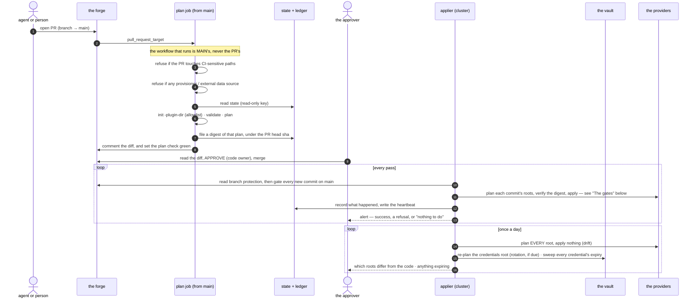
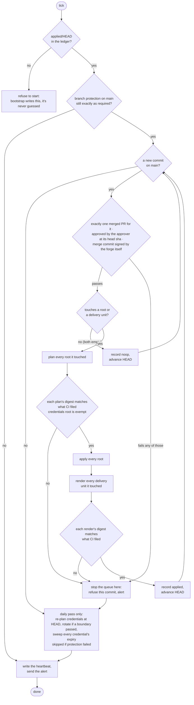

# Design

How a change travels from a pull request to applied infrastructure, and every
gate it has to pass on the way.

## Terms

- **the approver** — the single human account allowed to approve a change. An
  approval is the only thing that lets a change through, and nothing else in
  the system can give one.
- **a root** — one OpenTofu configuration with its own state file. Planned and
  applied separately; what a root's state holds decides who may read it.
- **the applier** — a small scheduled job inside the cluster. It is the only
  thing in the system holding credentials that can change anything.
- **the forge** — wherever the code and its reviews live. GitHub today, and
  the only implementation.

## What it assumes

Truss is not backend-agnostic and does not pretend to be. Today it assumes:

| Piece | Assumption |
| --- | --- |
| forge | GitHub — Apps, branch protection, PR reviews |
| infrastructure tool | OpenTofu, with a provider allowlist and one pinned version |
| ledger and state | object storage reachable as an S3-compatible endpoint (SigV4) |
| secret store | one vault the applier alone can read, one per project for runtime |
| alerting | one chat transport, on success as well as failure |

Making any of those swappable is a later problem. Naming them is the honest
alternative to a pluggability claim nothing has ever tested.

The ledger row claims durable storage and nothing more. It does **not** assume
a conditional write: no create-if-absent primitive is reachable from an
S3-compatible client against this endpoint, which is a measurement rather than
an oversight — see the comment above `Put` in `internal/ledger/store.go` for
what was tried and what the bucket answered. Mutual exclusion comes from the
layer that actually has it: the applier runs one pass at a time, and OpenTofu
holds its own state lock.

## The change path

Every change travels the same road: someone opens a pull request, a read-only
job describes what it would do, the approver approves it, and the applier —
not the approver, and not CI — is what actually applies it.

Two things in there are easy to skim past.

**A second loop exists purely to look. It never touches anything.** Ordinarily
a root only gets planned when some commit's diff touches it, which means a
root nobody's touched in git can drift for months and nothing would ever
check it. That's the actual gap, for a system whose entire premise is that
git is the source of truth. So once a day, every root gets planned, nothing
gets applied, and any root that differs gets **named** in the alert — never
just counted. *"Two roots drifted"* sends you off to find out which ones on
your own. That's homework, not an alert.

And the loop stops there on purpose. It reports what it sees and reconciles
nothing, because quietly undoing a change somebody made mid-incident would be
its own outage.

**A missing digest is a refusal, not a skip.** If no digest was filed for a
commit, the applier refuses that root rather than apply a plan nobody
reviewed. A check that passes when its own artifact is missing isn't a check.

**There are two plans, not one — and the applier never runs the one CI made.**
CI's plan is a preview, rendered for a human to read before they approve
anything. The applier throws that away and plans the approved commit again,
itself, with its own credentials, then applies the plan it just built. A hash
is what ties the two together: CI never hands the applier something to
execute, only a fingerprint of what a human already saw. *Require branch up
to date* is what keeps both plans looking at the same configuration in the
first place. Without it, they could each be correct on their own and still
disagree.

**The applier takes nothing on trust, however recently it was checked.** On
every run it re-reads the branch protection, the merge commit and the approval
from the API and satisfies itself again, rather than remembering that they
were fine last time.

## The gates

The applier doesn't trust that review happened just because GitHub says it
did. Before it touches anything, it checks, on its own, how the commit in
front of it actually got onto main. If the commit fails any one of those
checks, the applier rejects the whole change. Someone gets alerted to look at
it before it takes down your infrastructure.

**Every commit is gated, including the ones that touch no root.** The gate used
to run only after the touched-root set came back non-empty, so a commit that
changed only documentation, a CI workflow or anything else outside the roots
was recorded as a noop and HEAD advanced past it — without the approval, the
merged pull request or the merge-commit signature ever being asked for. A noop
record says *truss* did nothing; it has never meant nothing was done, and the
difference matters the moment anything else reads the same repository. The
price is three forge calls for every commit rather than only the ones that
apply something.

Only the very first refusal is a true dead end — no ledger entry to start from
means there's nothing yet to run a pass against. Every other outcome, whether
a commit gets refused, fails to apply, or applies cleanly, reaches the same
tail: a heartbeat always gets written and the alert always goes out — and on
the daily pass the rotation check and the expiry sweep run too, whatever the
queue did. Stopping the queue is not the same as going quiet.

One of those checks is whether the forge is still configured to require
everything below. The applier reads the settings back from the API and
compares them, rather than trusting that they're still what somebody set:

| Setting | Value | Why |
| --- | --- | --- |
| Require pull request before merging | on | no direct pushes to `main` |
| Required approving reviews | 1, **from Code Owners** | `CODEOWNERS` names the approver and nobody else, so only that one review counts |
| Dismiss stale approvals on push | on | an approval covers one exact commit, not a branch |
| Required status check | the plan check | no plan, no merge |
| Require branch up to date | on | the plan was computed against exactly what merges |
| Enforce for administrators | on | the approver has admin rights and could otherwise walk past every rule above by accident |
| Allow force pushes / deletions | off | history is the audit log |

## Rendered manifests are gated the same way, and the difference is instructive

A delivery unit is a Kustomize directory. CI renders it, hashes the exact
bytes, and files the digest under the same prefix as a plan digest; the
applier renders it again and refuses unless the bytes agree.

It is the easier half of the same idea, and the reason is worth stating. A
plan depends on the tree *and* on the live infrastructure, which is why
`internal/plan` reproduces a jq pipeline byte for byte and has to filter no-op
entries — two identities with different read permissions see different
attribute values in one plan, and that once made two "No changes" plans hash
differently and refused every apply. A render depends on the tree alone: no
state, no credentials. Network takes a line of its own, because "no network"
is not a property a renderer has on its own — `kustomize build` resolves a
remote `resources:` URL over the network by default and there is no flag to
turn that off. Measured on v5.7.1: a kustomization whose only resource was a
GitHub URL rendered cleanly, exit 0, the content fetched at build time.
`internal/render` closes it instead: every render runs with `HTTP_PROXY`,
`HTTPS_PROXY` and `ALL_PROXY` (both cases) pointed at a reserved `.invalid`
hostname that cannot resolve, and `NO_PROXY` emptied so it cannot wave a host
past the proxy — measured against the same kustomize: exit 1, zero bytes on stdout, the
reach failing at connect and naming the URL it wanted. A unit that genuinely
needs a remote base gets the same answer a chart does, below: vendor it into
the reviewed diff, where somebody reads it. So there is nothing to
canonicalise, the bytes are hashed as they are, and the renderer is handed
`PATH` and `HOME`, plus the proxy variables that enforce the no-network rule,
and nothing else. **The moment a render could read a credential, it could
produce output that depends on who ran it, and the two sides would stop
agreeing.**

Two consequences follow from the same fact:

- **A mismatch is never reported as "the world moved".** It cannot have been;
  a render reads no world. It means the two sides ran different renderer
  versions, the unit has a non-deterministic input, or the tree is not the one
  that was reviewed — and sending an operator to look at their infrastructure
  for a fault in their repository would waste the alert.
- **Nothing `gates.CheckRenderDigest` sees is exempt.** The credentials root is
  exempt from the *plan* gate because CI genuinely cannot plan it, which is a
  fact about the world rather than a convenience. Rendering has no equivalent
  fact, so a unit CI could not render is one the applier cannot render either.
  ⚠️ One case never reaches the gate at all: `renderOneUnit` skips a unit
  that is absent from the commit's own checkout, because that absence is the
  commit deleting it — a prune, not an edit. The reconciler removes what it
  applied, and refusing here would make retiring a workload impossible; see
  the threat-model row for deleting a delivery unit.

**Digest-gate exemptions, stated together so "every apply is digest-gated"
cannot quietly go false one kind at a time:**

| Kind | Digest gate | What is reviewed instead | Why |
| --- | --- | --- | --- |
| `credentials` (a `tofu` root) | exempt from the plan digest | the code diff itself | CI cannot plan this root — its state *is* the tokens, so there is nothing CI could read to file a digest against (`docs/credentials.md`) |
| every other `tofu` root | plan digest | CI's plan hash vs. the applier's own re-plan | a plan is a function of the tree *and* live infrastructure, so an independent re-plan is the only thing that proves nothing moved between review and apply |
| `render` (a delivery unit) | render digest, no exemption | CI's render hash vs. the applier's own re-render | a render is a function of the tree alone, so any unit CI could not render is a unit that will not render for the applier either |
| `ansible` (a play) | **no digest at all** | the code diff itself, plus `gates.CheckAnsibleTargets` | CI cannot reach the hosts a play would run against, by the same design that keeps it out of the plan and render tiers — so anything CI could file would be a function of the commit alone, and the commit is already pinned by the merge-provenance gate. A digest here would be a check that cannot fail. What a digest cannot give is supplied by a different gate instead: declared hosts must be non-empty, every declared host must be observed reachable *at the moment of the run* by whichever provider vouches for it, and no device may carry the managed tag without an inventory record — refusing the whole pass if one does |

The `ansible` row is the same precedent `credentials` already sets —
`docs/credentials.md`: *"what a human reviews here is the code diff itself,
not a plan"* — applied a second time, for a structurally identical reason
rather than a copy of the same one: both roots have state (tokens; a
machine's configuration) that CI is not allowed to read or reach.

`runCommitLoop` calls both (`cmd/truss/ansible_unit.go`): plays run after
every OpenTofu root and before every render — infrastructure makes the
machine, configuration configures it, delivery ships onto it — and each one
is proved before it runs. The target set comes from `inventory.Host.Config`
inverted; the live half comes from a **provider of host evidence**, and a
host no provider can vouch for is refused rather than run unchecked: with no
evidence about which hosts exist there is no gate, and this kind has nothing
else.

**Tailscale is one provider, not the definition of evidence**
(`cmd/truss/evidence.go`). Each host's `access.via` says which one vouches
for it: `tailscale` reads the device list through `tailnet.Reconcile`, and
`address` dials the address the record itself states, through
`internal/reach`. A record naming an address is a *declaration*; the dial is
the *observation*, made at the moment of the run and never inferred from the
record. Both are first class — a fleet reached by SSH over stated addresses
is a real way to run machines, and an engine that could not configure one
would be this deployment's process compiled into a general tool. It is also
what makes **first contact** possible at all: a host that has never joined a
tailnet has no device record, so under a tailscale-only gate it could never
be a target, so the play that would have joined it could never run.

⚠️ **The two providers do not offer the same guarantee, and the applier says
so.** Tailscale can be asked which machines *claim* to be managed and answer
with ones nobody declared — an intruder, or a host somebody forgot — which
is the single most valuable thing this gate does. A declared-address
provider has no such list and cannot acquire one: the only addresses it
knows are the ones the inventory already names, so the set it can look at is
by construction the set that is already declared. That is a real reduction
in safety rather than an implementation gap, so `hostEvidence.Discovers()`
is a method on the interface rather than a convention about an empty slice,
and a pass carrying any non-discovering provider narrates the limit on every
run. "We looked and the fleet is clean" and "nothing here could look" both
produce zero names, and they are different promises.

⚠️ **`internal/gates.CheckAnsibleTargets` names no vendor and must not
start.** It takes `Declared`, `Unknown` and `Unreachable` and refuses; where
those three lists came from is the caller's business. That is why making
evidence pluggable changed no refusal: the gate was already the right shape,
and the seam belonged above it. Three absence rules now differ by kind, deliberately — an absent root
is a **refusal** (its state may hold live resources), an absent delivery
unit is a **prune** (the reconciler removes what it applied), and an absent
play is a **retirement**: deleting it un-configures nothing, the machine
keeps exactly what it has, and claiming otherwise in either direction would
be a lie about somebody's machine.

Only one of the three ways Helm could get in is actually enforced; the other
two are a rule the deployment keeps, not a check the applier makes.
`--enable-helm` is never passed, so a kustomization carrying a `helmCharts`
field is refused by kustomize itself when the flag is absent — measured on
v5.7.1: exit 1, zero bytes, "must specify --enable-helm" — and that needs no
parser, matching AGENTS.md's rule to gate on the field rather than rendered
text. Passing the flag would make the renderer fetch a chart from a repository
*at render time*, the same network reach the proxy settings above exist to
prevent, and it re-admits `randAlphaNum` and `now`, which can never hash the
same twice. Nothing in this tree refuses a `helm_release` resource in an
OpenTofu root, and nothing checks for a helm binary on the machine — see
docs/work-items.md for what closing either would take. Charts are inflated
once, by hand, and the rendered manifests are committed — so the reviewer
reads the manifests rather than a version number.

The applier renders and compares. It applies nothing: a reconciler does that —
and what it hands over is a ref rather than an artefact.

**`refs/heads/queued` is the boundary between reviewed and running.** After a
pass has gated a commit, applied every root it touched and matched every render
against the digest CI filed, it fast-forwards that ref to the commit. A
reconciler tracks `queued` and never `main`, so it can only ever see commits
the applier has already gated: a refusal anywhere freezes the ref, every
cluster holds its last known-good state, and the alert says why.

The applier refuses to publish onto a ref whose history nothing protects — an
unprotected ref is not a weaker gate, it is a path to production nobody is
watching. It re-reads the rulesets covering that ref and requires them to
restrict updates, block force pushes and block deletion, for the reason `main`
needs the same: history is the audit log, and a cluster was told to apply what
is in it. The check runs before the push, because discovering afterwards would
be discovering it too late.

**Only the applier's own App may move the ref, and this is now checked, not
assumed.** `gates.CheckDeliveryRef` refuses a ruleset applying to `queued`
unless its `bypass_actors` is either empty or exactly one entry naming the
applier's GitHub App (`actor_type` `Integration`, `actor_id` equal to the App
id the applier's own `github-app` credential holds) with `bypass_mode`
`always` — the one combination that turns an `update` rule ("only bypass
permission may update matching refs") into "only the applier may update this
ref" rather than "nobody may" or "anyone named here may". A second actor, a
different App's id, any non-Integration actor (`User`, `Team`,
`RepositoryRole`, `OrganizationAdmin`, `DeployKey`), or a `bypass_mode` other
than `always` is refused by name. This is deliberately the opposite of what
`main`'s gate does with a bypass actor (any non-empty `bypass_actors` there is
the hole) — on `main` a bypass actor is a second door around approval; on
`queued`, approval already happened, and the single App bypass is what makes
the door have exactly one key.

The push is a plain fast-forward with no lease and no force, so the ordering
property is git's rather than ours: a ref somebody else has moved makes this
fail loudly instead of overwriting whatever they did. A delivery ref
disagreeing with the applier is a fact somebody needs to look at.

The name is `queued` and not `delivered` because delivered implies done, and
truss cannot know a cluster has the manifests at the moment it hands them over.
And a deployment with no delivery units is never asked to protect a ref it does
not use — the tree decides, so a tree that is pure OpenTofu owes nothing here.

Absent isn't the same as false, and code that treats them the same is
dangerous here: `jq '.allow_force_pushes.enabled // true'` turns a compliant
`false` into a non-compliant `true`, because `//` fires on `false` exactly as
readily as on `null`. `internal/gates` uses pointers instead, so a missing key
is its own case — one that never silently reads as compliant.

A merged PR's `merged` field has to come from the detail endpoint. The list
endpoint returns PR objects with no `merged` field at all, only `merged_at` —
read it from the list and you get `null` for every PR that's ever been
merged.
