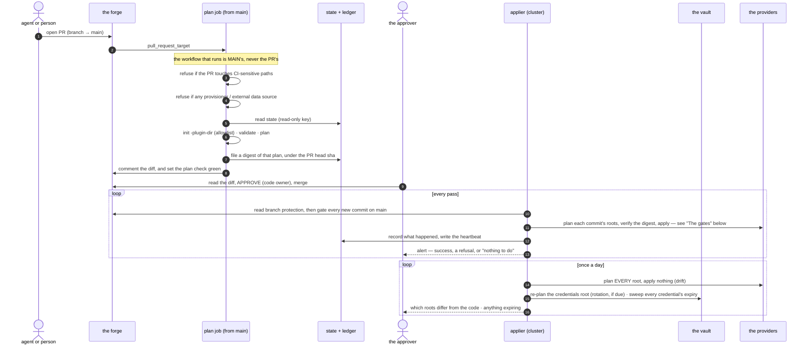
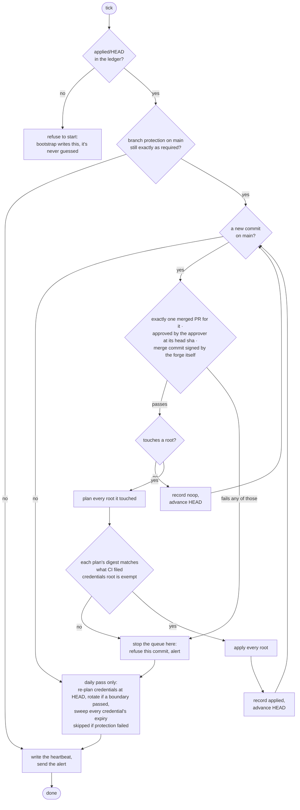

# Design

How a change travels from a pull request to applied infrastructure, and every
gate it has to pass on the way.

## Terms

- **the approver** — the single human account allowed to approve a change. An
  approval is the only thing that lets a change through, and nothing else in
  the system can give one.
- **a root** — one OpenTofu configuration with its own state file. Planned and
  applied separately; what a root's state holds decides who may read it.
- **the applier** — a small scheduled job inside the cluster. It is the only
  thing in the system holding credentials that can change anything.
- **the forge** — wherever the code and its reviews live. GitHub today, and
  the only implementation.

## What it assumes

Truss is not backend-agnostic and does not pretend to be. Today it assumes:

| Piece | Assumption |
| --- | --- |
| forge | GitHub — Apps, branch protection, PR reviews |
| infrastructure tool | OpenTofu, with a provider allowlist and one pinned version |
| ledger and state | object storage reachable as an S3-compatible endpoint (SigV4) |
| secret store | one vault the applier alone can read, one per project for runtime |
| alerting | one chat transport, on success as well as failure |

Making any of those swappable is a later problem. Naming them is the honest
alternative to a pluggability claim nothing has ever tested.

The ledger row claims durable storage and nothing more. It does **not** assume
a conditional write: no create-if-absent primitive is reachable from an
S3-compatible client against this endpoint, which is a measurement rather than
an oversight — see the comment above `Put` in `internal/ledger/store.go` for
what was tried and what the bucket answered. Mutual exclusion comes from the
layer that actually has it: the applier runs one pass at a time, and OpenTofu
holds its own state lock.

## The change path

Every change travels the same road: someone opens a pull request, a read-only
job describes what it would do, the approver approves it, and the applier —
not the approver, and not CI — is what actually applies it.

Two things in there are easy to skim past.

**A second loop exists purely to look. It never touches anything.** Ordinarily
a root only gets planned when some commit's diff touches it, which means a
root nobody's touched in git can drift for months and nothing would ever
check it. That's the actual gap, for a system whose entire premise is that
git is the source of truth. So once a day, every root gets planned, nothing
gets applied, and any root that differs gets **named** in the alert — never
just counted. *"Two roots drifted"* sends you off to find out which ones on
your own. That's homework, not an alert.

And the loop stops there on purpose. It reports what it sees and reconciles
nothing, because quietly undoing a change somebody made mid-incident would be
its own outage.

**A missing digest is a refusal, not a skip.** If no digest was filed for a
commit, the applier refuses that root rather than apply a plan nobody
reviewed. A check that passes when its own artifact is missing isn't a check.

**There are two plans, not one — and the applier never runs the one CI made.**
CI's plan is a preview, rendered for a human to read before they approve
anything. The applier throws that away and plans the approved commit again,
itself, with its own credentials, then applies the plan it just built. A hash
is what ties the two together: CI never hands the applier something to
execute, only a fingerprint of what a human already saw. *Require branch up
to date* is what keeps both plans looking at the same configuration in the
first place. Without it, they could each be correct on their own and still
disagree.

**The applier takes nothing on trust, however recently it was checked.** On
every run it re-reads the branch protection, the merge commit and the approval
from the API and satisfies itself again, rather than remembering that they
were fine last time.

## The gates

The applier doesn't trust that review happened just because GitHub says it
did. Before it touches anything, it checks, on its own, how the commit in
front of it actually got onto main. If the commit fails any one of those
checks, the applier rejects the whole change. Someone gets alerted to look at
it before it takes down your infrastructure.

**Every commit is gated, including the ones that touch no root.** The gate used
to run only after the touched-root set came back non-empty, so a commit that
changed only documentation, a CI workflow or anything else outside the roots
was recorded as a noop and HEAD advanced past it — without the approval, the
merged pull request or the merge-commit signature ever being asked for. A noop
record says *truss* did nothing; it has never meant nothing was done, and the
difference matters the moment anything else reads the same repository. The
price is three forge calls for every commit rather than only the ones that
apply something.

Only the very first refusal is a true dead end — no ledger entry to start from
means there's nothing yet to run a pass against. Every other outcome, whether
a commit gets refused, fails to apply, or applies cleanly, reaches the same
tail: a heartbeat always gets written and the alert always goes out — and on
the daily pass the rotation check and the expiry sweep run too, whatever the
queue did. Stopping the queue is not the same as going quiet.

One of those checks is whether the forge is still configured to require
everything below. The applier reads the settings back from the API and
compares them, rather than trusting that they're still what somebody set:

| Setting | Value | Why |
| --- | --- | --- |
| Require pull request before merging | on | no direct pushes to `main` |
| Required approving reviews | 1, **from Code Owners** | `CODEOWNERS` names the approver and nobody else, so only that one review counts |
| Dismiss stale approvals on push | on | an approval covers one exact commit, not a branch |
| Required status check | the plan check | no plan, no merge |
| Require branch up to date | on | the plan was computed against exactly what merges |
| Enforce for administrators | on | the approver has admin rights and could otherwise walk past every rule above by accident |
| Allow force pushes / deletions | off | history is the audit log |

## Digest-gate exemptions, stated together so "every apply is digest-gated" cannot quietly go false one kind at a time

| Kind | Digest gate | What is reviewed instead | Why |
| --- | --- | --- | --- |
| `credentials` (a `tofu` root) | exempt from the plan digest | the code diff itself | CI cannot plan this root — its state *is* the tokens, so there is nothing CI could read to file a digest against (`docs/credentials.md`) |
| every other `tofu` root | plan digest | CI's plan hash vs. the applier's own re-plan | a plan is a function of the tree *and* live infrastructure, so an independent re-plan is the only thing that proves nothing moved between review and apply |

Absent isn't the same as false, and code that treats them the same is
dangerous here: `jq '.allow_force_pushes.enabled // true'` turns a compliant
`false` into a non-compliant `true`, because `//` fires on `false` exactly as
readily as on `null`. `internal/gates` uses pointers instead, so a missing key
is its own case — one that never silently reads as compliant.

A merged PR's `merged` field has to come from the detail endpoint. The list
endpoint returns PR objects with no `merged` field at all, only `merged_at` —
read it from the list and you get `null` for every PR that's ever been
merged.
